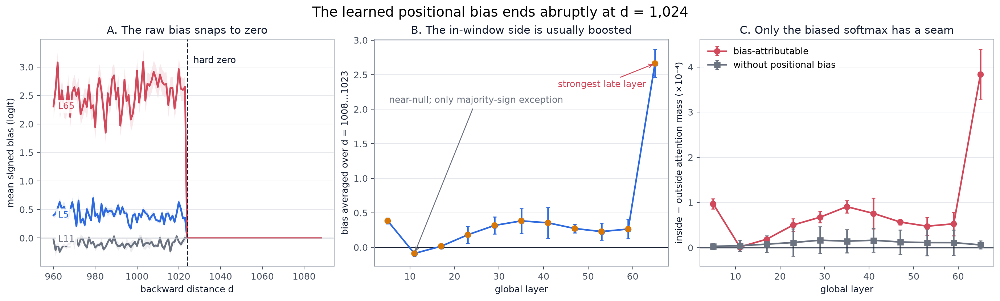
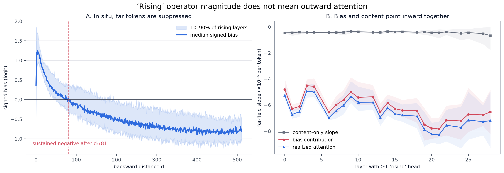
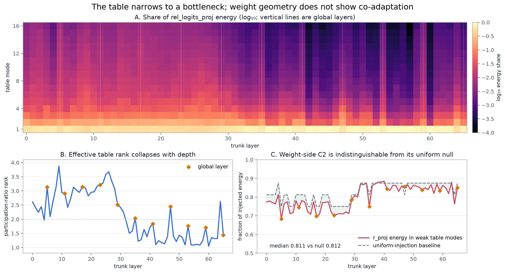
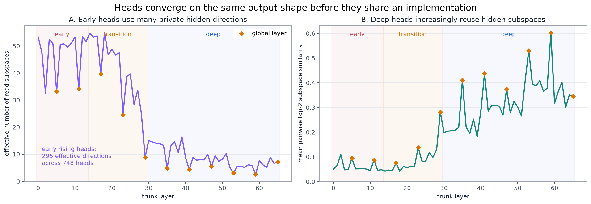
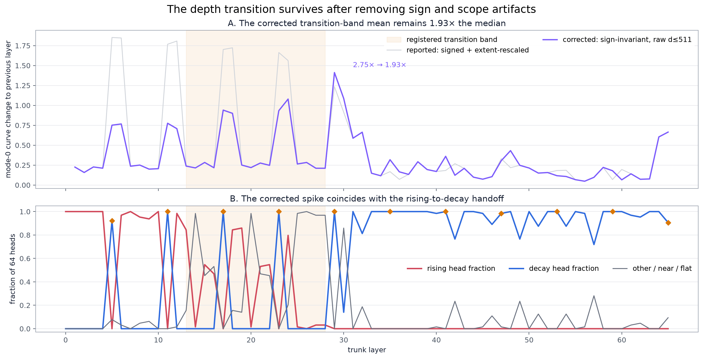

# Inkling positional-encoding explanatory figures

These figures extend the existing Round 2/3 plots with the Round 4 and Tier-2
results. They are generated entirely from existing JSON/NPZ artifacts; no model
execution, GPU work, or network access is required.

**Audit update:** the C2 weight-side interpretation and the original C5
magnitude have been revised. The figures regenerated by the current script use
the corrected wording and C5 estimator. The complete correction, needle
retrieval analysis, 512-token echo, and L65 terminal-wall figures are in
`analysis/revised_mechanisms/README.md`.

Reproduce them with:

```powershell
python scripts\explanatory_figures.py
```

## 1. The seam is visible and causal



The learned bias is hard-zeroed at `d = 1024`. The mean bias-attributable
attention step is positive at all 11 global layers, while layer 11 is near-null
and the only layer where fewer than half of heads have a positive step. The
same softmax without the positional-bias term is approximately continuous at
the boundary. Layer 65 is the strongest case.

## 2. “Rising” magnitude means inward suppression in situ



The Round 3 `rising` label was assigned to the magnitude of a weight-space
operator profile; it did not determine the sign of the realized logit. Tier-2
activations settle that ambiguity: the median signed bias becomes persistently
negative by about `d = 81`, and the bias-effect slope is negative in all 144
layer-by-corpus tests. Content decay and the positional bias therefore pull
attention inward together.

## 3. The table is a bottleneck; weight-side C2 is null



The projection table's median participation-ratio rank falls from 2.97 over
layers 0–28 to 1.37 over layers 30–65. But the weight-side utilization statistic
does not show co-adaptation: median vestigial fraction is 0.811 versus a 0.812
uniform baseline. The meaningful result is activation-side: live r-vectors have
median cosine 0.84 with the table's `S²` profile. See
`analysis/revised_mechanisms/interface-live-coadaptation.png`.

## 4. Output agreement precedes circuit sharing



Early layers can assign nearly every head the same output taxonomy while those
heads still read from many different hidden directions. The median effective
number of per-layer read subspaces falls from 50.8 in layers 0–13 to 7.8 in
layers 30–65, while mean pairwise similarity rises from 0.05 to 0.31. Across
748 early rising heads, there are still about 295 effective read directions;
this is not one shared “look far” circuit.

**Follow-up refinement:** this is accurate about weight geometry but incomplete
about functional use. Live r-vector captures show that early activations already
concentrate most positional-read energy in communal directions even while the
head weights remain diverse. See `analysis/subspace_anatomy/README.md`.

## 5. The corrected phase-transition verdict survives



The original C5 statistic mixed two artifacts into its 2.75× magnitude: SVD
mode signs were canonicalized by a near-field anchor that changes sign around
the transition, and 512/1024-token curves were rescaled to the same unit axis.
With sign-invariant distances on the common raw `d=0…511` support, the
transition-band ratio is 1.93×. That is smaller but still above the registered
1.5× phase-transition threshold.

## Interpretation limits

- Tier-2's “without bias” result is a layer-local counterfactual with that
  layer's inputs held fixed, not a full 66-layer ablation.
- Signed claims come from Tier-2 activations. Sign-canonicalized SVD modes alone
  cannot determine whether a magnitude profile boosts or suppresses a token.
- “Weak table modes” are defined using the ceiling of the table's
  participation-ratio rank. The weight-side metric is indistinguishable from
  its uniform null; only the activation-side result supports co-adaptation.
- The corrected C5 ratio supports the registered phase-transition verdict, but
  its magnitude is about 30% smaller than originally reported.

Exact aggregates used above are in `figure_summary.json`.
