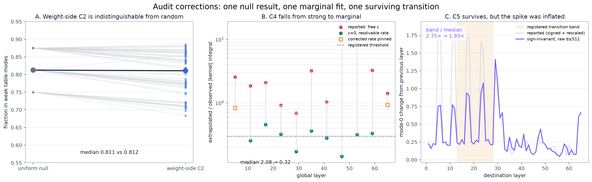
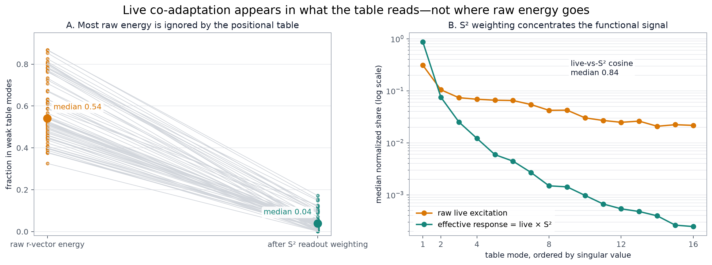
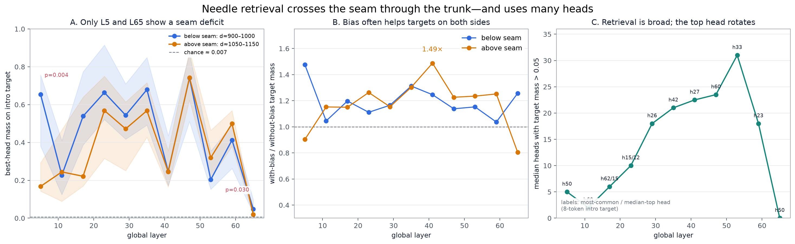
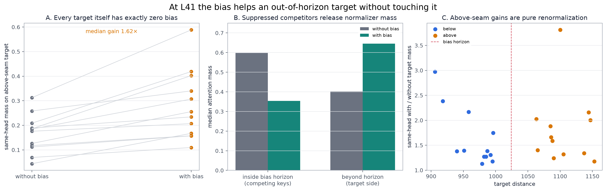
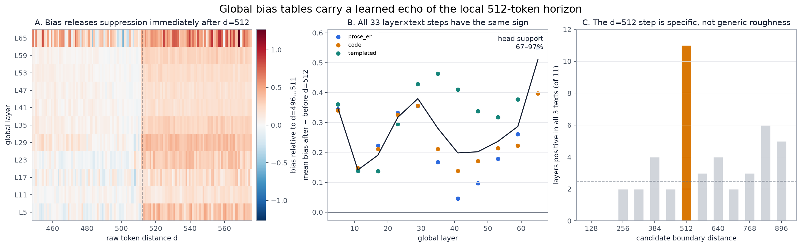
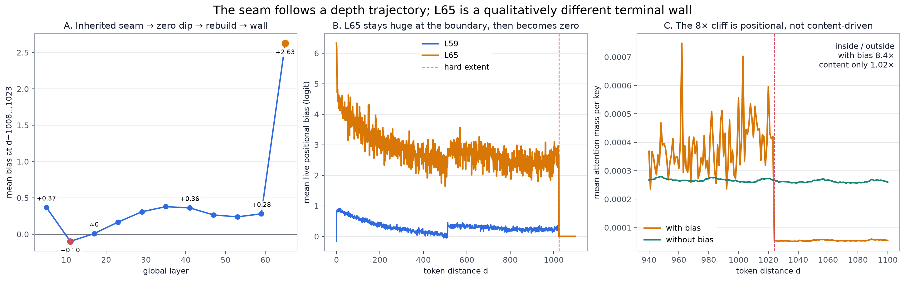
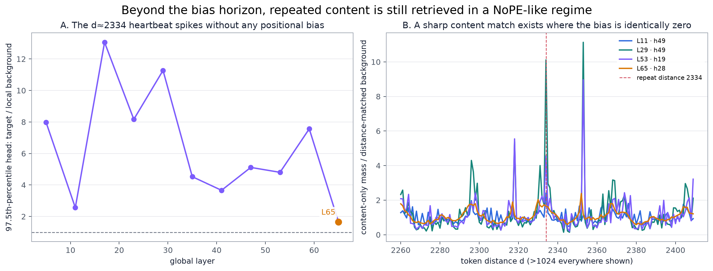

# Revised Inkling mechanism picture

This set folds the audit corrections and the newly captured needle behavior into
the explanatory story. The largest change is conceptual: the hard bias horizon
is **not** a hard retrieval horizon. Through the middle of the network, the bias
acts mainly as a contrast enhancer inside a content-addressable attention
system. Layer 65 is the exception: there the same horizon becomes a terminal
wall.

Reproduce every panel and the exact aggregates with:

```powershell
python scripts\revised_mechanism_figures.py
```

The script reads only saved weights, NPZ captures, and JSON analyses. It does
not execute the model or require a GPU.

## 1. Three audit corrections



- **C2 weight-side is null.** Its median vestigial fraction is `0.8108`, versus
  `0.8125` under uniform injection. Weight geometry does not reveal selective
  use of the interface.
- **C4 is marginal, not strong.** The original free constant is extrapolated
  across a region three times wider than the observations. At L53 it reaches
  `c = -466.9` while amplitudes compensate it; L35/L53/L59/L65 also hit the
  original `1e-5` slow-rate bound. With `c=0` and the slow rate constrained to
  at least `1/extent`, the median truncated fraction is `0.321`, just over the
  registered `0.3` threshold. L5 and L65 remain pinned and unreliable.
- **C5 survives at a smaller magnitude.** Comparing curves sign-invariantly on
  the same raw `d=0…511` support reduces the transition-band ratio from `2.75×`
  to `1.93×`. That still clears the registered `1.5×` phase-transition
  threshold.

The old C4 and C5 outputs remain preserved as registered historical results;
the corrected per-layer C4 fits are in `revised_mechanism_summary.json`.

## 2. Where live co-adaptation actually appears



The activation result is informative even though the weight result is not.
Live r-vectors have median cosine `0.838` with the table's `S²` profile, so
tokens preferentially excite the modes the projection can read. But raw energy
itself is broad: a median `54.0%` lies beyond the table's effective-rank cutoff.
After weighting by `S²`, only `3.85%` of the effective response remains there.

That is the clean form of the co-adaptation claim: **selection occurs in the
readout, not by forcing all raw r-vector energy into the strongest modes.**

## 3. Needle retrieval crosses the seam



Best-head attention mass on the planted intro is orders of magnitude above the
approximately `0.007` chance level at every global layer. A two-sided
Mann–Whitney test finds a below/above-seam deficit only at L5 (`p=0.0043`) and
L65 (`p=0.0304`). From L23 through L59, every test has `p>0.2`; L53 and L59
even have higher above-seam point estimates.

Retrieval is distributed rather than induction-head-sparse. Using a fixed
eight-token intro target, the median number of heads above `0.05` mass reaches
`23.5/64` at L47. The strongest head rotates with depth: L47 is head 60, while
L59 is head 23 under the median-target definition. There is no stable retrieval
head lineage.

## 4. The bias is a contrast enhancer, not a gate



At L41 every above-seam target is beyond the 1024-token table and therefore
receives **exactly zero positional bias**. Nevertheless, evaluating the same
best-with-bias head before and after exact bias removal gives a median target
gain of `1.62×`.

The normalizer explains it. Across the twelve above-seam needles, the median
attention mass assigned inside the bias horizon falls from `0.598` without the
bias to `0.354` with it. The freed mass moves to the bias-free far side
(`0.402 → 0.646`), including the content-matched needle. The positional term
changes competition among keys; it does not need to touch the winning key.

The without-bias rows are reconstructed exactly as
`w_without ∝ w_with · exp(-b)` and renormalized causally.

## 5. A 512-token echo couples local and global scopes



Every global layer shows a release from suppression immediately after `d=512`,
the local layers' window size. The adjacent-band step
`mean(b[512:528]) - mean(b[496:512])` is positive in all `33/33` combinations
of 11 global layers and three corpora. Its magnitude ranges from `+0.046` to
`+0.583` logits and is supported by `67–97%` of heads.

The identical test at other candidate distances is much less consistent: a
median `2.5/11` layers are positive in all three texts, versus `11/11` at 512.
This is a small but unusually clean division-of-labor signature: global layers
learn to compensate precisely where local layers lose visibility.

## 6. Seam depth trajectory and the L65 wall



The live edge bias follows a structured depth path:

```text
L5 +0.37 → L11 -0.10 → L17 +0.01 → L23…L59 +0.17…+0.38 → L65 +2.63
```

So the seam is inherited strongly, dips through zero, rebuilds through the
trunk, and then changes scale at the terminal layer.

At L65 the mean bias is `5.19` logits over `d=0…7` and still `2.66` over
`d=1008…1023`, before becoming exactly zero. Mean attention mass drops `8.38×`
across the boundary. The content-only counterfactual is essentially flat
(`2.669e-4` inside versus `2.608e-4` outside; ratio `1.02×`). This makes L65 an
effective 1024-token local integrator even though it is architecturally global.

## 7. Pure-content retrieval beyond the horizon



The templated corpus repeats a heartbeat at about `d=2334`, far beyond the
learned table. In `mean_mass_without`, a robust high-head statistic (97.5th
percentile across heads) is `2.6–13.1×` its distance-matched background from
L11 through L59. L65 falls to `1.66×`.

This is a functional confirmation of the NoPE-like far field: once the learned
bias ends, global layers can still retrieve by content alone. The final layer
again behaves differently.

## Statistical distinction from the subspace analysis

The activation C3 statistic subtracts each head's token mean before its SVD, so
it measures alignment of **fluctuations**. The headline carrier in
`analysis/subspace_anatomy` is the **mean** r-vector. These are complementary
statistics, not two estimates of the same object: a shared mean carrier can
coexist with diverse mean-centered fluctuations.

The in-situ bias curves are decay/step dominated and show no crisp oscillatory
component. That agrees with the weight-side conclusion that the trained
relative table uses learned transport kernels rather than reconstructing a
RoPE-like sinusoidal clock.

All numeric values used in the captions are in
`revised_mechanism_summary.json`.
