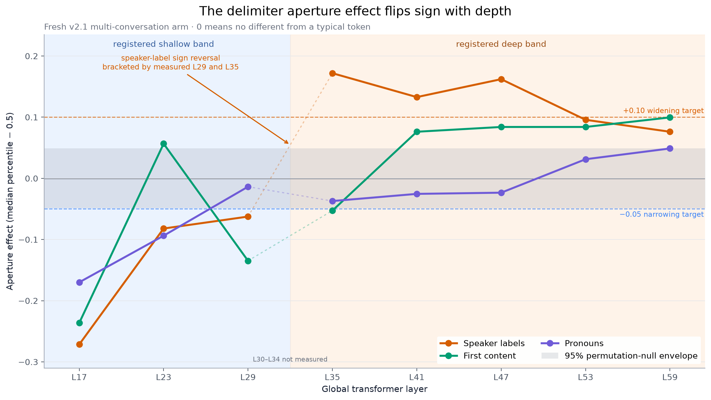
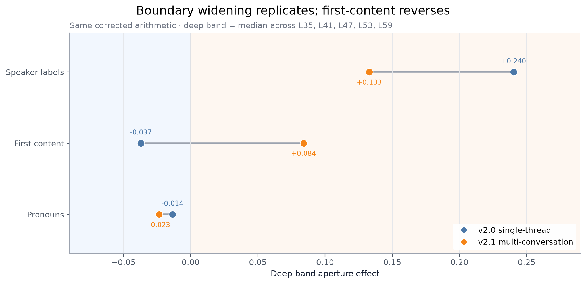
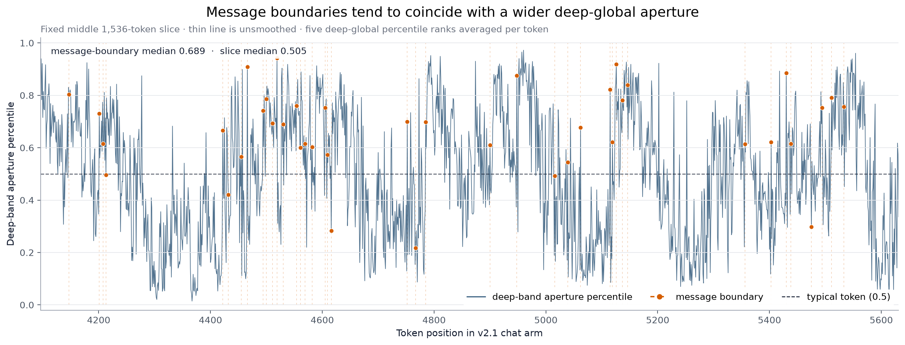
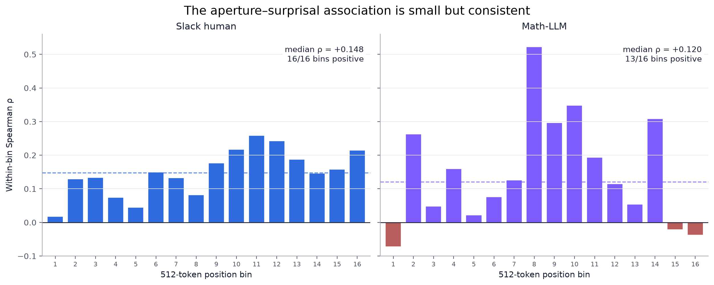
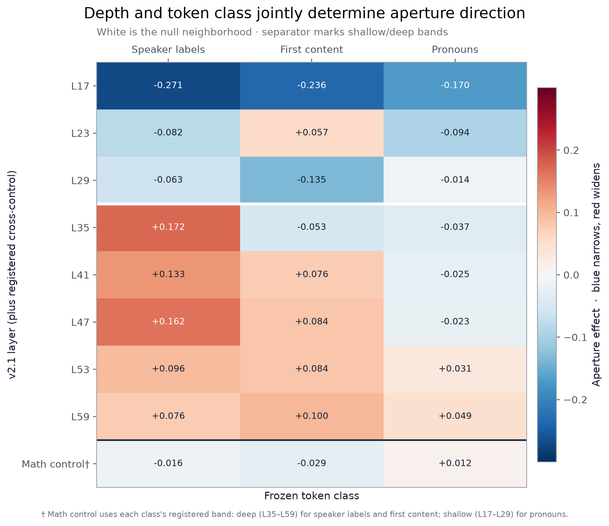
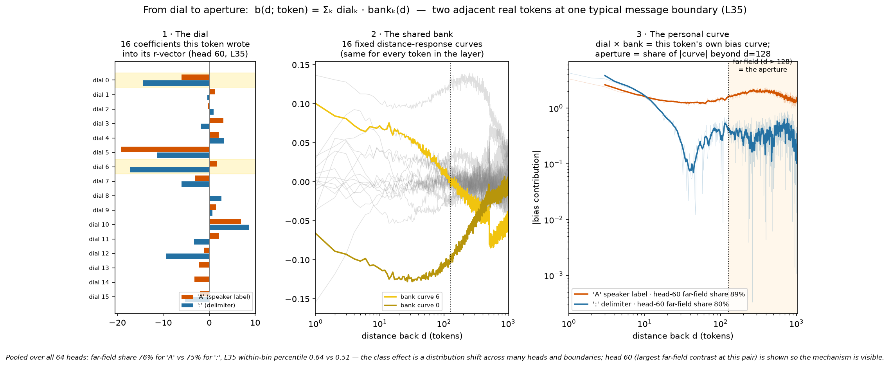
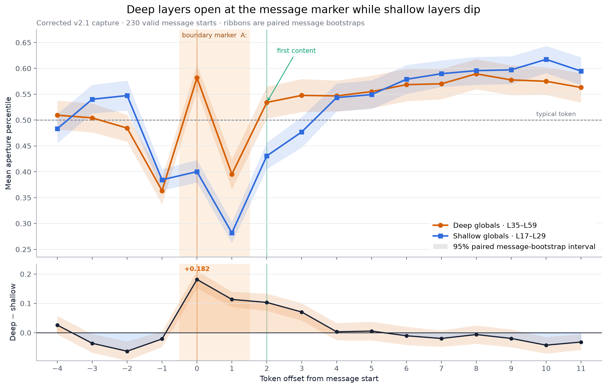
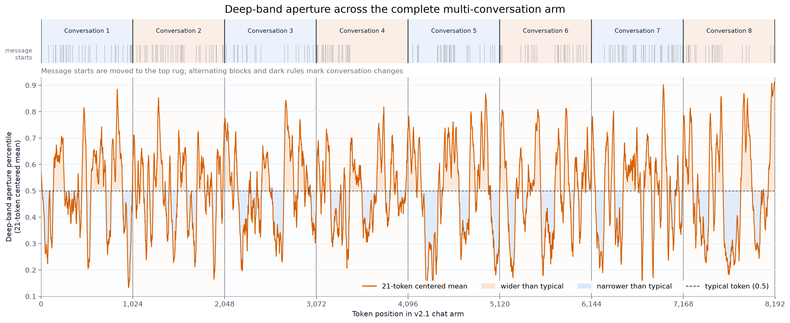

# Corrected corpus-v2 aperture figures

These five figures turn the corrected corpus-v2 and depth-resolved results into
a compact visual narrative. Reproduce them with:

```powershell
python scripts\corpus_v2_corrected_figures.py
```

The script validates every input hash recorded by the corrected reports and
aperture manifest before plotting. It writes the exact plotted aggregates and
source hashes to [`figures/figure_data.json`](figures/figure_data.json).
Displayed aperture effects use signed fixed-point notation with three decimal
places and decimal round-half-up (`-0.0625` is shown as `-0.063`).

The compact result JSONs are committed. The corrected aperture arrays and
private class freezes are intentionally gitignored, as documented in
[`RESULTS.md`](RESULTS.md); the locally sealed copies are required to regenerate
Figures 1–3 and 5. No raw token-level values or private text are promoted by
the figure script.

## Figure 1 — depth-flip profile



Speaker labels cross from narrow at L29 (`-0.063`) to wide at L35 (`+0.172`).
The shallow-band median is `-0.082`; the deep-band median is `+0.133`.
First-content reverses its registered prediction and becomes mostly wide in the
deep band, while pronoun narrowing is concentrated at shallow depth.
The faint dashed L29→L35 segments bridge five unmeasured layers (L30–L34);
they show adjacency between measured endpoints, not a measured crossing point.

The grey ribbon is deliberately conservative: it is the envelope spanning the
three committed registered-test 95% permutation-null intervals, not a
pointwise confidence interval for each line. The dashed `+0.10` and `-0.05`
lines are the registered widening and narrowing thresholds.

## Figure 2 — replication and reversal



The same corrected arithmetic is used for both arms. Speaker/message-start
widening is positive in the v2.0 single-thread arm (`+0.240`) and the fresh
v2.1 multi-conversation arm (`+0.133`). First-content moves from `-0.037` to
`+0.084`, crossing zero. Pronouns are close to zero in both deep bands.

Speaker-label widening therefore attenuates by `0.107` (about 45%) from the
single-thread arm to the multi-conversation arm. That arm contrast is post hoc
and descriptive, so the observed arms are not reused as a test. It motivates
the fresh-data context-dose prediction frozen in the prospective
[`P-e` preregistration](../../../registrations/ROUND5_APERTURE_CONTEXT_DOSE_PREREG.md).

The v2.0 freeze did not name a first-content class; its displayed positions are
the deterministic v2.1 definition applied to the frozen v2.0 message starts:
`start + 2`. This comparison is descriptive. The v2.1 depth predictions and
bands remain the preregistered tests.

## Figure 3 — aperture along the text



This is the fixed middle 1,536-token slice (`4096:5632`) of the v2.1 chat arm,
chosen by position rather than outcome. The thin line is unsmoothed. Each token
value is the mean of its within-256-token percentile rank across the five deep
global layers; dashed orange lines and dots mark frozen message boundaries.

The boundary distribution is visibly shifted upward, but not every boundary
is a spike. The exact boundary count and slice/boundary medians are recorded in
`figure_data.json`.

## Figure 4 — aperture–surprisal law



Each bar is the committed Spearman correlation within one 512-token position
bin. Slack is modest in magnitude but positive in all `16/16` bins, with median
`ρ = +0.148`. Math-LLM has median `ρ = +0.120` and `13/16` positive bins. The
shared y-axis preserves the actual effect sizes and the large math-arm outlier.

## Figure 5 — depth × class overview



The eight v2.1 layer rows use the same frozen estimator as Figure 1. The bottom
row contains the committed crossed-math control for each class in that class's
registered band: deep for speaker labels and first-content, shallow for
pronouns. Those near-white cells show that the same position masks read null on
the math arm. The dagger's band definition is repeated in small print on the
PNG so the saved figure remains self-contained.

Blue means narrower than a typical token, red means wider, and the colormap is
symmetrically centered at zero. The horizontal white separator marks the
shallow/deep transition; the dark separator isolates the control row.

## Figure 6 — from dial to aperture (mechanism explainer)



What the dial *is*: each token writes 16 coefficients (its r-vector, one set
per head) that multiply the layer's fixed bank of 16 distance-response curves;
the sum is that token's personal bias curve over distance, and the aperture is
the share of that curve's mass beyond d=128. The figure walks the pipeline on
two adjacent real tokens — a speaker label 'A' and its ':' — at one typical
message boundary (selection rule and provenance hashes in
[`figures/figure-06-dial-data.json`](figures/figure-06-dial-data.json):
deterministic, percentiles jointly closest to the class medians at L35, the
strongest registered layer). The plotted head is the one with the largest
far-field contrast at this pair (disclosed on the figure); pooled all-head
shares and within-bin percentiles are given in the caption so the head-level
view cannot be mistaken for the class-level statistic.

## Exploratory figures (peeked; follow-ups registered as P-e / P-f)

These two figures come from the token-level exploration of the v2.1 arm that
generated the P-e (`ROUND5_APERTURE_CONTEXT_DOSE_PREREG.md`) and P-f
(`ROUND5_APERTURE_ANCHOR_PREREG.md`) registrations. They are exploratory: no
claim here is confirmed until those families evaluate on fresh data.



Boundary anatomy (±4/+11 tokens, 230 message starts, paired message bootstrap
5,000 resamples): the end-of-message newline narrows both bands; the speaker
label is the flip token (deep opens, shallow dips); the ':' after it is the
narrowest token measured (shallow 0.28); the deep−shallow difference panel
shows the divergence is a boundary-locked transient (offsets 0–3, peak +0.182
[0.151, 0.211]) over a slightly negative body baseline. Caveats: top-panel
y-axis starts at 0.25; the shaded "boundary marker" span covers both the label
and the colon, which behave oppositely.



Deep-band aperture across the whole v2.1 arm; message starts in the top rug,
conversation switches as dark rules. Caveat: the arm contains nine
conversations — the ninth is a trimmed stub at the final token and is not
labeled as a block. Switch positions sit one token below multiples of 1,024
because BPE merges one token at each channel seam (the A7 join effect).
Plotted aggregates and input hashes:
[`figures/exploratory/improved_figure_summary.json`](figures/exploratory/improved_figure_summary.json).
