# Round 5 follow-up seven publication figures

Status: **independently verified; post-verdict visualizations**

Each numbered discovery has two standalone figures. PNG files are
300 dpi; PDF and SVG are vector exports from the same Matplotlib
artists. SVG typography is stored as glyph paths for cross-viewer
stability. Interpretive synthesis panels are labeled post-verdict and
do not change any registered disposition.

## 1. F7-1a — signed distance ablation forest

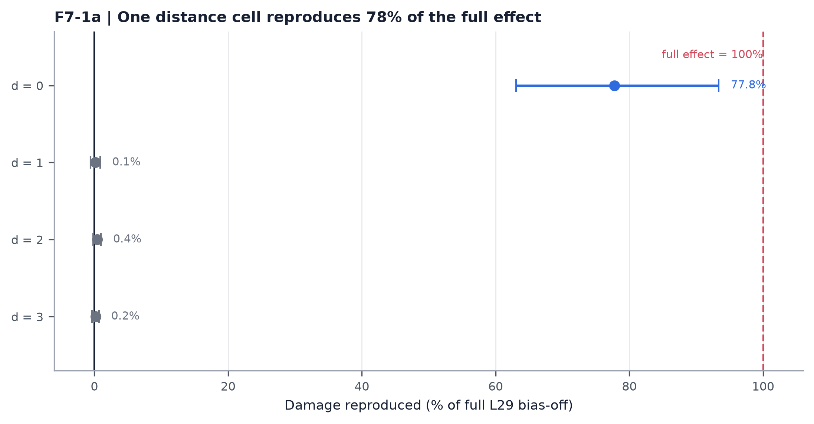

Registered singleton effects and 95% block-bootstrap intervals. Removing d=0 is the only Holm-confirmed singleton and reproduces 77.8% of full L29 bias-off damage.

Sources: `results.json:F7-1.singleton_inference`; `results.json:F7-1.certified_bias_off_cost`.

Exports: [`PNG`](./f7-1a-distance-ablation-forest.png) · [`PDF`](./f7-1a-distance-ablation-forest.pdf) · [`SVG`](./f7-1a-distance-ablation-forest.svg)

## 2. F7-1b — stencil necessity and sufficiency

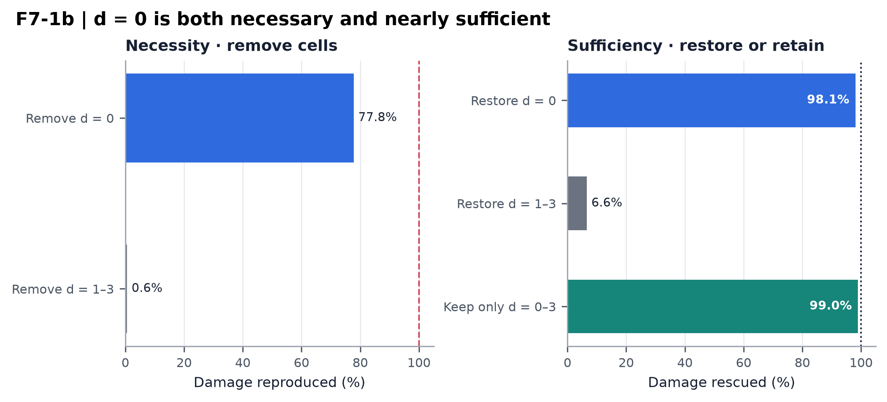

Complementary ablation and restoration arms resolve the causal near field to d=0. Restoring d=0 rescues 98.1%; retaining only d=0..3 rescues 99.0%.

Sources: `results.json:F7-1.costs`; `results.json:F7-1.stencil_rescue_fraction`.

Exports: [`PNG`](./f7-1b-stencil-necessity-sufficiency.png) · [`PDF`](./f7-1b-stencil-necessity-sufficiency.pdf) · [`SVG`](./f7-1b-stencil-necessity-sufficiency.svg)

## 3. F7-2a — shoulder interaction forest

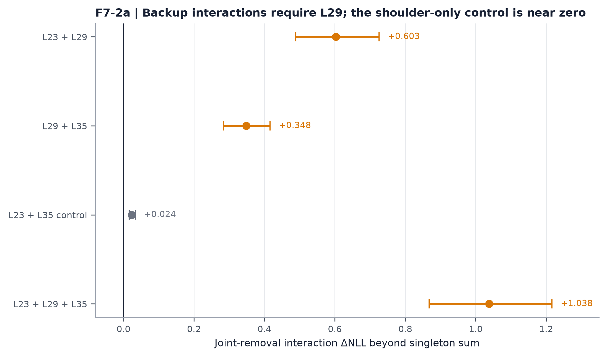

Registered joint-minus-singleton interactions with 95% block-bootstrap intervals. Every L29-containing set is strongly super-additive; the L23+L35 control is small.

Sources: `results.json:F7-2.interactions`.

Exports: [`PNG`](./f7-2a-shoulder-interaction-forest.png) · [`PDF`](./f7-2a-shoulder-interaction-forest.pdf) · [`SVG`](./f7-2a-shoulder-interaction-forest.svg)

## 4. F7-2b — shoulder interactions by text

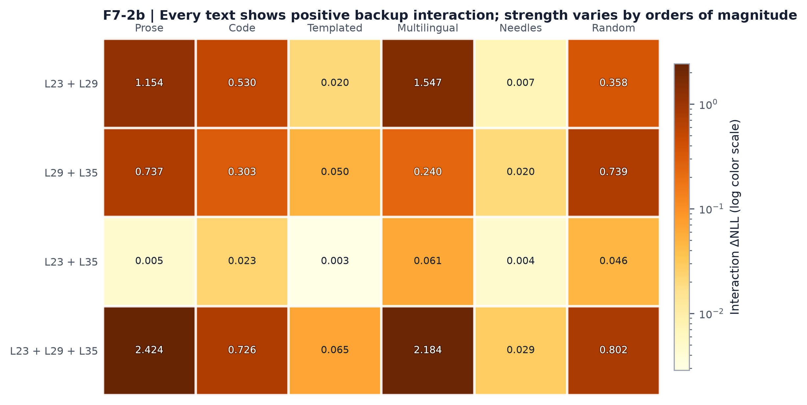

Raw per-text joint-minus-singleton mean ΔNLL. A log color scale reveals positive redundancy across all 24 cells while preserving the 800-fold range.

Sources: `followup arm token dumps`; `certified R5-D singleton token dumps`.

Exports: [`PNG`](./f7-2b-shoulder-interaction-heatmap.png) · [`PDF`](./f7-2b-shoulder-interaction-heatmap.pdf) · [`SVG`](./f7-2b-shoulder-interaction-heatmap.svg)

## 5. F7-3a — r-component causal costs

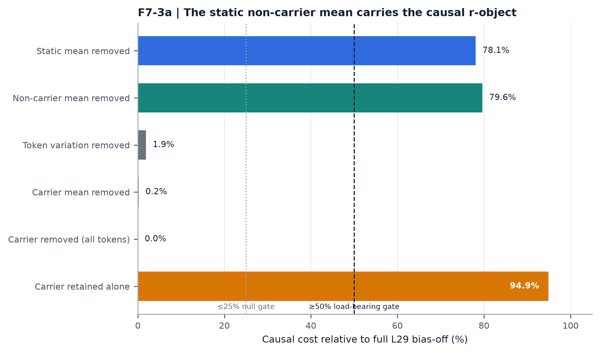

Pooled component costs relative to full L29 bias-off. Static mean and non-carrier mean reproduce most damage; centered and carrier removals are null-scale.

Sources: `results.json:F7-3.ratios_to_bias_off`.

Exports: [`PNG`](./f7-3a-r-component-causal-costs.png) · [`PDF`](./f7-3a-r-component-causal-costs.pdf) · [`SVG`](./f7-3a-r-component-causal-costs.svg)

## 6. F7-3b — r components by text

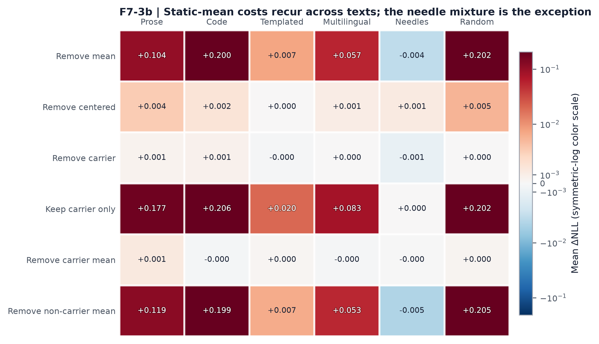

Raw per-text mean ΔNLL for all six registered r-space interventions, shown with a symmetric-log color scale and exact cell labels. The needle mixture is the clear low-cost exception to the otherwise stable static-mean mechanism.

Sources: `followup r-component token dumps`.

Exports: [`PNG`](./f7-3b-r-components-by-text.png) · [`PDF`](./f7-3b-r-components-by-text.pdf) · [`SVG`](./f7-3b-r-components-by-text.svg)

## 7. F7-4a — head-quartile localization

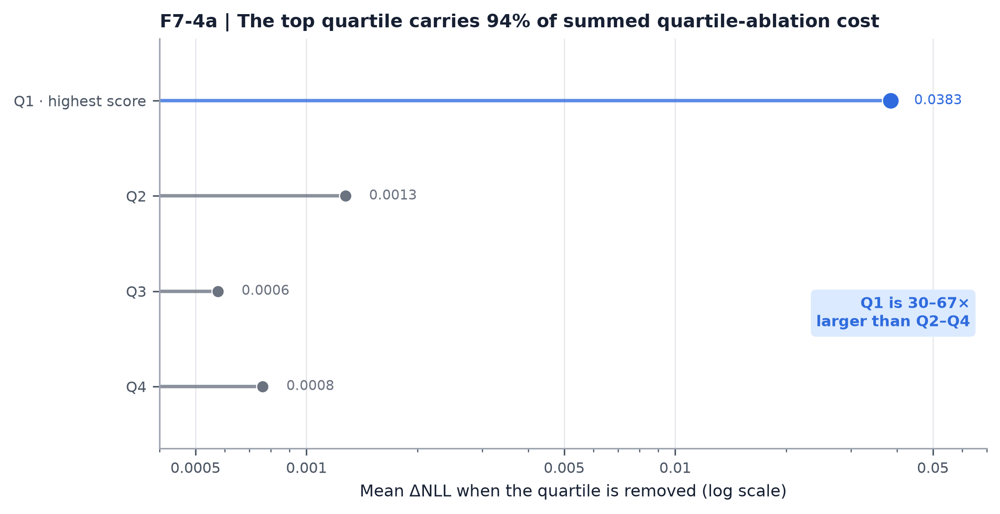

Pooled cost of removing each frozen 16-head quartile on a logarithmic ΔNLL axis. The highest pre-outcome stencil-score quartile carries 94% of the summed quartile-ablation cost and costs 30–67 times more than Q2–Q4.

Sources: `results.json:F7-4.costs`.

Exports: [`PNG`](./f7-4a-head-quartile-localization.png) · [`PDF`](./f7-4a-head-quartile-localization.pdf) · [`SVG`](./f7-4a-head-quartile-localization.svg)

## 8. F7-4b — nested head rescue

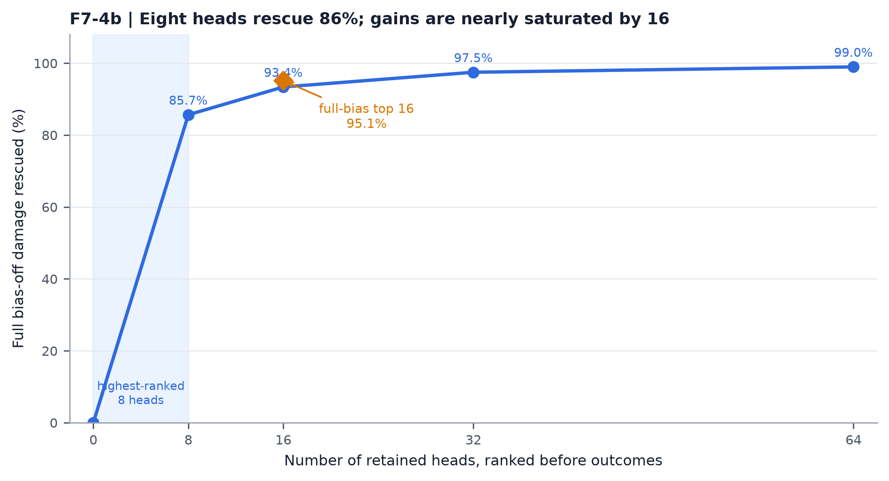

Damage rescued by retaining the nested top-8/16/32/64 d=0..3 stencils. Rescue reaches 93.4% with 16 heads and 97.5% with 32.

Sources: `results.json:F7-4.costs`; `frozen_inputs.npz:head_order`.

Exports: [`PNG`](./f7-4b-head-rescue-saturation.png) · [`PDF`](./f7-4b-head-rescue-saturation.pdf) · [`SVG`](./f7-4b-head-rescue-saturation.svg)

## 9. F7-5a — query-state rescue forest

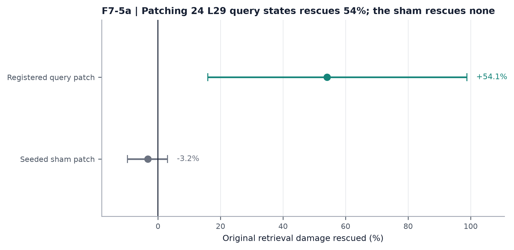

Needle-recall rescue as a percentage of the common parent damage, with registered 95% bootstrap intervals transformed to the same scale. Query patching rescues 54.1%; the seeded sham interval spans zero.

Sources: `results.json:F7-5`.

Exports: [`PNG`](./f7-5a-query-patch-rescue-forest.png) · [`PDF`](./f7-5a-query-patch-rescue-forest.pdf) · [`SVG`](./f7-5a-query-patch-rescue-forest.svg)

## 10. F7-5b — token-level query mediation

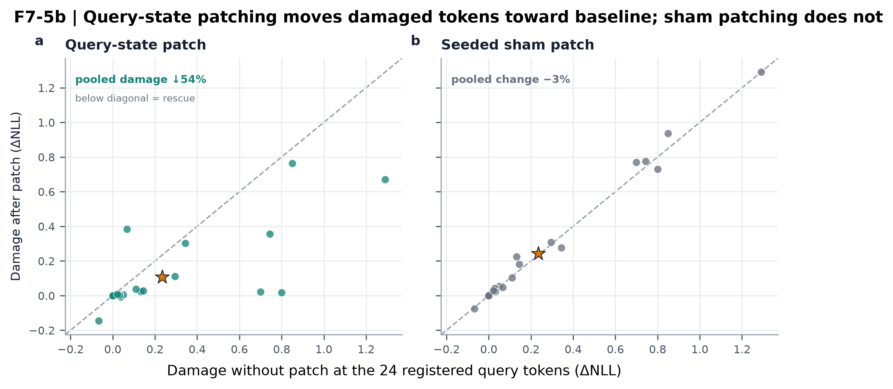

Each point is one of 24 registered needle queries. Query-state patching moves the pooled mean below the equality line; sham patching does not.

Sources: `frozen_inputs.npz:patch_query_positions`; `parent and patch token dumps`.

Exports: [`PNG`](./f7-5b-query-token-paired-scatter.png) · [`PDF`](./f7-5b-query-token-paired-scatter.pdf) · [`SVG`](./f7-5b-query-token-paired-scatter.svg)

## 11. F7-6a — held-out clock transfer

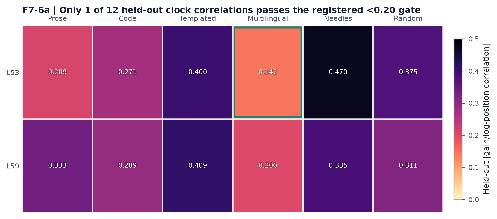

Residual median-head clock gain correlation after projecting the five-text LOTO basis. Only one of twelve cells meets the registered <0.20 transfer criterion.

Sources: `results.json:F7-6.kernel_gain_correlation.clock_loto_L53_L59`.

Exports: [`PNG`](./f7-6a-clock-loto-transfer-heatmap.png) · [`PDF`](./f7-6a-clock-loto-transfer-heatmap.pdf) · [`SVG`](./f7-6a-clock-loto-transfer-heatmap.svg)

## 12. F7-6b — clock geometry versus behavior

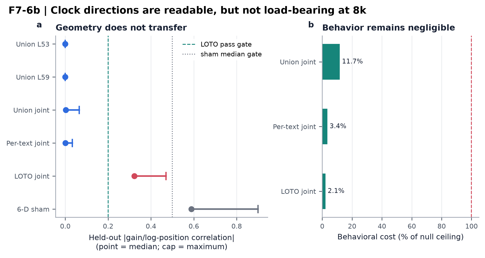

Fitted union/per-text bases flatten kernel drift, whereas LOTO transfer fails. Behavioral costs are normalized to the registered 0.005 NLL null ceiling; every real joint intervention remains below 12% of it.

Sources: `results.json:F7-6.kernel_gain_correlation`; `results.json:F7-6.behavior_costs`.

Exports: [`PNG`](./f7-6b-clock-geometry-behavior-dissociation.png) · [`PDF`](./f7-6b-clock-geometry-behavior-dissociation.pdf) · [`SVG`](./f7-6b-clock-geometry-behavior-dissociation.svg)

## 13. F7-7a — ranking versus calibration

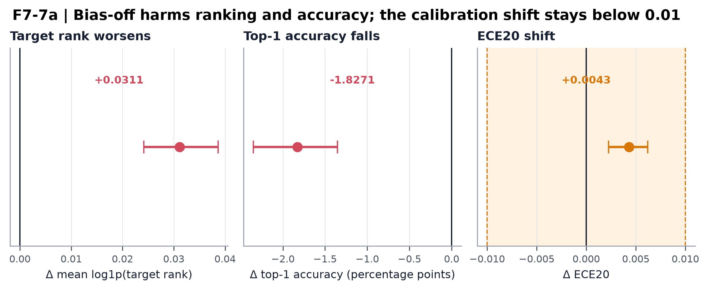

Registered full-vocabulary effects and 95% intervals. Rank and accuracy worsen decisively; ECE changes significantly but remains inside the ±0.01 promotion band.

Sources: `results.json:F7-7.ranking`; `results.json:F7-7.calibration`.

Exports: [`PNG`](./f7-7a-ranking-versus-calibration.png) · [`PDF`](./f7-7a-ranking-versus-calibration.pdf) · [`SVG`](./f7-7a-ranking-versus-calibration.svg)

## 14. F7-7b — fresh class replication

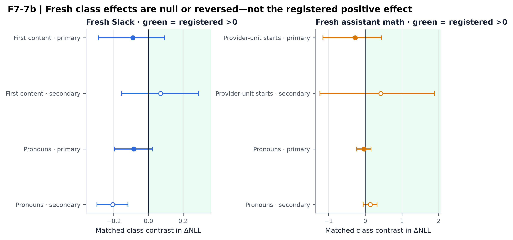

Matched query- and target-aligned class contrasts on fresh Slack and assistant-math text. No registered primary contrast is positive; Slack pronouns invert significantly in the secondary alignment.

Sources: `results.json:F7-7.fresh_classes`.

Exports: [`PNG`](./f7-7b-fresh-class-replication-forest.png) · [`PDF`](./f7-7b-fresh-class-replication-forest.pdf) · [`SVG`](./f7-7b-fresh-class-replication-forest.svg)

## 15. Synthesis A — revised 8k mechanism

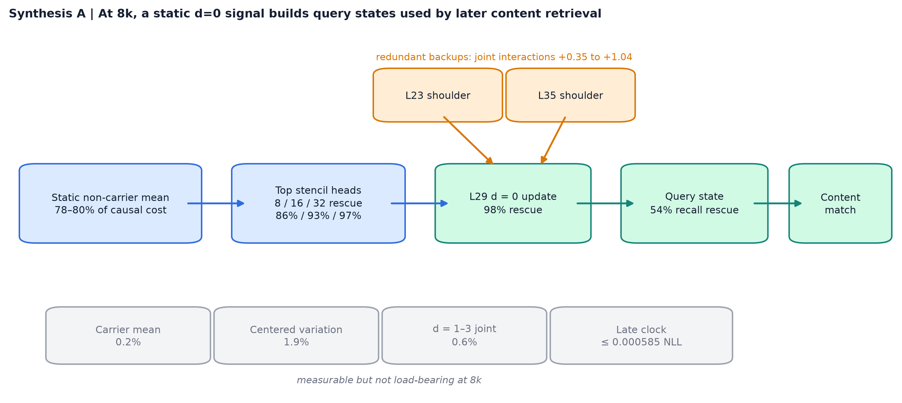

Post-verdict graphical interpretation: a static non-carrier mean drives a sparse d=0 stencil in top heads, improving query construction for downstream content matching; shoulders provide redundancy.

Sources: `certified F7-1 through F7-6 results`.

Exports: [`PNG`](./synthesis-a-revised-mechanism-map.png) · [`PDF`](./synthesis-a-revised-mechanism-map.pdf) · [`SVG`](./synthesis-a-revised-mechanism-map.svg)

## 16. Synthesis B — registered evidence matrix

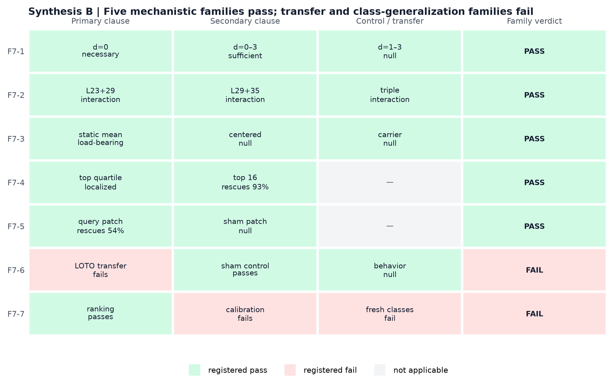

Clause-level disposition of all seven families. F7-1 through F7-5 pass; F7-6 fails transfer despite behavioral nullity; F7-7 passes ranking but fails calibration promotion and fresh replication.

Sources: `verification.json:verdicts`; `results.json:families`.

Exports: [`PNG`](./synthesis-b-registered-evidence-matrix.png) · [`PDF`](./synthesis-b-registered-evidence-matrix.pdf) · [`SVG`](./synthesis-b-registered-evidence-matrix.svg)

## Reproduction

```powershell
.\.venv-tier2\Scripts\python.exe scripts/round5_followup7_figures.py
```

`figure_data.json` preserves the plotted summary and raw-derived
values; `figure_manifest.json` records source/output hashes and
pixel dimensions. `contact-sheet-1.png` and `contact-sheet-2.png`
are QA views only, not manuscript figures.
