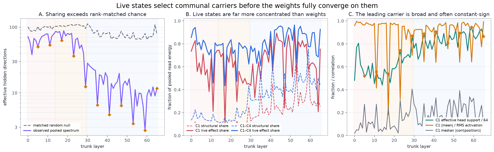
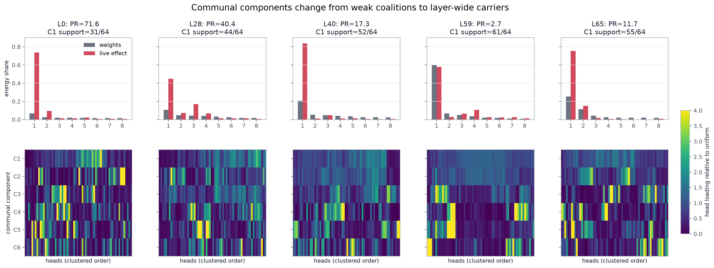
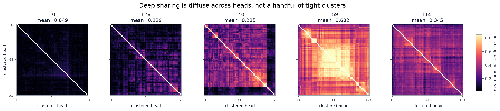
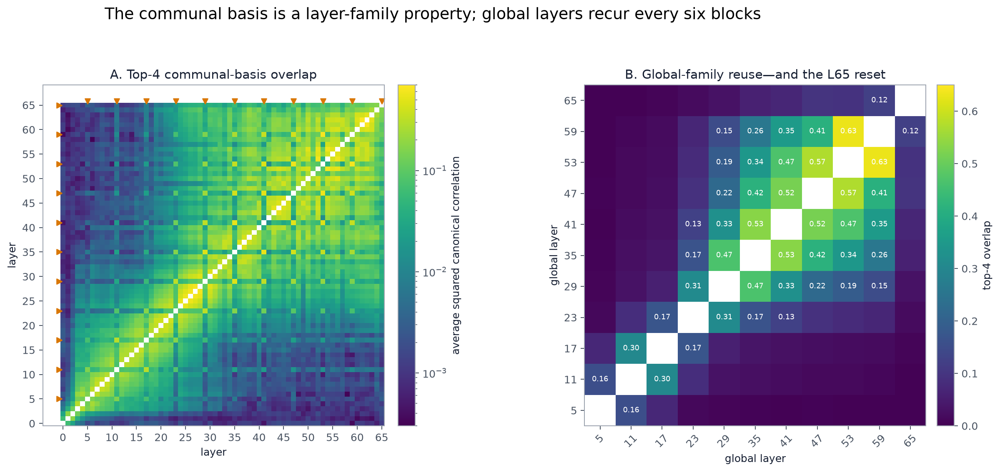
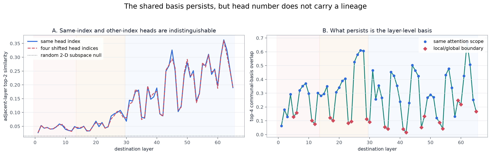
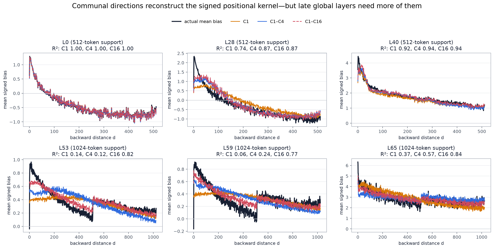

# Inkling hidden read-subspace anatomy

This follow-up decomposes the hidden-space directions through which each
attention head drives the learned relative-position table. It extends Round 4
C3 and the earlier `head-subspace-sharing.png` figure.

The central refinement is important: **early heads have diverse weight-space
read directions, but their live activations are already dominated by communal
carriers.** “Private weights” therefore does not imply a functionally private
positional circuit.

Reproduce the analysis with:

```powershell
python scripts\subspace_anatomy.py
```

## Method

For head `h`, take the top two right-singular directions `v_h1, v_h2` of its
composed hidden-to-distance operator. Weight them by their singular values and
normalize each head to equal total energy:

```text
M_h = [s_h1 v_h1, s_h2 v_h2] / sqrt(s_h1² + s_h2²)
M   = stack_h M_h                       # [128, 6144]
```

The eigenspectrum of `M Mᵀ` gives the communal hidden directions shared across
heads. This avoids sign ambiguity and separates within-head rank collapse from
cross-head sharing.

The random null preserves every head's measured `s_h1/s_h2` ratio and exact
within-head orthogonality, but replaces the directions with random 6,144-D
subspaces. The live effect of each communal component is recovered from the
saved Tier-2 r-vectors using the identity
`V_h x = U_hᵀ projᵀ r_h / S_h`. A direct check against normalized hidden states
gave relative error `5.5e-4` and correlation `0.9999998`.

This mean-carrier analysis is deliberately different from Round 4 C3-act.
C3-act subtracts the token mean before its per-head SVD and therefore measures
alignment of **fluctuations**. Here the headline carrier is the **mean**
r-vector. A strong shared mean and diverse mean-centered fluctuations can both
be true; the two analyses are complementary rather than competing estimates.

## 1. Weight geometry and live use tell different stories



- Layers 0–13 use a median 69.5 effective communal directions, versus 98.3 in
  the singular-value-matched random null. Early sharing is weak but already
  above chance.
- Layers 30–65 fall to 12.7 directions, versus a matched-null median of 73.7.
- Yet the leading communal direction already carries a median 65.2% of live
  pooled read energy in layers 0–13; the deep-layer median is 70.7%.
- At layer 0, component 1 is only 6.7% of structural weight energy but 73.6% of
  live effect energy. It is nearly constant-sign (`|mean|/RMS = 0.958`) and by
  itself reconstructs the average signed bias with `R² = 0.998`.

So the residual stream selects a common positional carrier long before the
heads' weights collapse onto a common basis.

## 2. The shared components become layer-wide, not merely clustered



The heatmaps show each communal component's squared loading on the 64 heads,
relative to a uniform allocation. Early components are uneven coalitions. Deep
component 1 is broad:

- median effective support in layers 30–65: 54.1 heads;
- layer 59: 60.5 effective heads, 60.1% of structural energy, and 57.7% of live
  effect energy;
- layer 65: the spectrum broadens again to 11.7 effective directions, but live
  state still puts 75.3% of read energy through component 1.



The head-pair matrices confirm the same point. Sharing becomes diffuse across
most of the layer rather than resolving into a few isolated head cliques. Mean
top-two subspace similarity rises from 0.049 at layer 0 to 0.602 at layer 59,
then falls to 0.345 at the final layer.

## 3. The basis belongs to layer families, not head identities



The fixed top-four communal bases form depthwise families. Global-to-global
overlap is stronger than local-to-local overlap and much stronger than
cross-scope overlap:

| pair type | mean top-four overlap | median |
|---|---:|---:|
| global/global | 0.152 | 0.072 |
| local/local | 0.083 | 0.029 |
| global/local | 0.036 | 0.022 |

The late global sequence is especially coherent: layers 53 and 59 have overlap
0.632. Layer 65 is a terminal reset, with only 0.12 overlap to layer 59 despite
its extremely strong signed seam effect.



Matching head number across adjacent layers provides no detectable advantage:
the median same-head improvement over shifted head indices is only `0.00030`,
and it is positive in 52.3% of layer transitions. What persists is a
layer-level basis; the model does not maintain a “head 17 positional lineage”
through depth.

## 4. Communal directions are actual positional kernels



Projecting each communal hidden direction back through every head produces its
signed distance kernel. Averaging those kernels with their measured live
activation reconstructs the actual Tier-2 bias:

- layer 0: one direction is essentially the whole mean kernel (`R² = 0.998`);
- layer 40: one direction gives `R² = 0.919`;
- layers 53 and 59: component 1 carries much of the energy, but 16 communal
  directions are needed for detailed shape (`R² = 0.818` and `0.772`);
- layer 65: 16 directions give `R² = 0.837`.

This separates **energy dominance** from **shape completeness**. A component can
carry most read energy while smaller components determine the near-field spike,
the 512-distance shoulder visible in late global layers, or other fine shape.

## Interpretation

The best current picture is a two-stage convergence:

1. The residual stream learns a strong, often constant-sign scalar carrier that
   many otherwise-diverse head operators can read.
2. With depth, the head operators themselves rotate into a small communal basis
   spread across nearly all heads.

The late global layers reuse that basis every six blocks, but individual head
indices do not persist. The final layer partially resets the weight geometry
while retaining an extremely concentrated live carrier.

Exact per-layer metrics, adjacency traces, affinity matrices, and reconstruction
scores are in `subspace_anatomy.json`. The extracted top-four bases are in
`common_bases_top4.npz`.

## Limits

- The communal basis is defined from each head's top two operator modes. Smaller
  per-head modes can still affect fine kernel shape; the 16-component
  reconstructions quantify this residual.
- Basis directions have arbitrary sign. Energy, support, subspace overlap, and
  kernel reconstructions are sign-invariant; activation means use a consistent
  decomposition sign internally.
- The activation analysis measures the six existing 8,192-token corpora. It is
  much stronger than a weight-only inference, but it is not a behavioral
  ablation of the communal directions.
